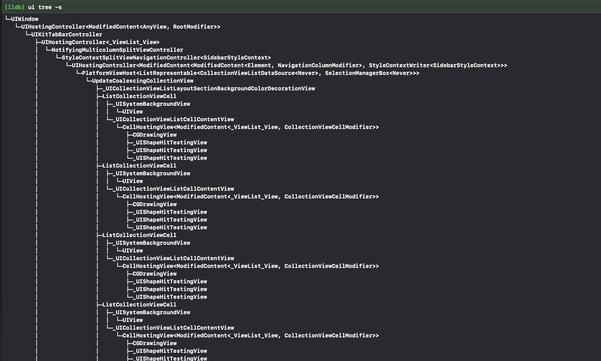

# iLLDB
LLDB Extension for iOS App Development

<!-- # Badges -->

[](https://github.com/p-x9/iLLDB/issues)
[](https://github.com/p-x9/iLLDB/network/members)
[](https://github.com/p-x9/iLLDB/stargazers)
[](https://github.com/p-x9/iLLDB/)

## Feature
- [Show view hierarchy](#ui-hierarchy)
- [Easy operation of UserDefaults](#userdefaults)
- [Show device information](#device-info)
- [Show App information](#app-info)
- [Show file hierarchy](#file-hierarchy)
- [Open directory in Finder (Simulator Only)](#open-directory-in-finder-app-simulator-only)

## Set up
1. clone this repository
2. Add the following line to ~/.lldbinit
    ```
    command script import {PATH TO iLLDB}/src/iLLDB.py
    ```

## Usage

### UI hierarchy
```
(lldb) ui tree -h
usage:  tree
       [-h]
       [-d]
       [-s]
       [--window WINDOW]
       [--view VIEW]
       [--vc VC]
optional arguments:
  -h, --help
    show this help message and exit
  -d, --detail
    Enable detailed mode (default: False)
  -s, --simple
    Enable simpled mode (default: False)
  --window WINDOW
    Specify the target window (default: None)
  --view VIEW
    Specify the target view (default: None)
  --vc VC
    Specify the target viewController (default: None)
```

#### Example
- Show keyWindow hierarchy
    ```sh
    ui tree
    ```
    

    ```sh
    ui tree -s # simple
    ```
    

    ```sh
    ui tree -d # detail
    ```
    

- Show the hierarchy of a specific view
    ```
    ui tree -view {property name of view}
    ```

- Show the hierarchy of a specific viewController
    ```
    ui tree -vc {property name of viewController}
    ```

- Show the hierarchy of a specific window
    ```
    ui tree -window {property name of window}
    ```

### UserDefaults
```
usage:
       [-h]
       {read,write,delete,read-all,delete-all}
       ...
UserDefault debugging
optional arguments:
  -h, --help
    show this help message and exit
Subcommands:
  {read,write,delete,read-all,delete-all}
    read
    read UserDefault value
    write
    write UserDefault value
    delete
    delete UserDefault value
    read-all
    read all UserDefault value
    delete-all
    delete all UserDefault value
```
#### read
```sh
ud read "key"
```

#### write
```sh
ud write "key" "value"
```

#### delete
```sh
ud delete "key"
```

#### read all
```sh
ud read-all
```

#### delete all
```sh
ud delete-all
```

### Device Info
Displays device information.
```sh
device info
```


### App Info
Displays App information.
```sh
app info
```


### File hierarchy
```
(lldb) file tree -h
usage:  tree
       [-h]
       [-l]
       [--documents]
       [--tmp TMP]
optional arguments:
  -h, --help
    show this help message and exit
  -l, --library
    library directory (default: False)
  --documents
    documents directory (default: False)
  --tmp TMP
    tmp directory (default: None)
```

#### Example
- Display the contents of the Bundle directory
    ```sh
    file tree --bundle
    ```

- Display the contents of the Library directory
    ```sh
    file tree --library
    ```

- Display the contents of the Documents directory
    ```sh
    file tree --documents
    ```

- Display the contents of the tmp directory
    ```sh
    file tree --tmp
    ```

- Display the contents of a specific directory
    ```sh
    file tree {url}
    ```


### Open directory in Finder App (Simulator Only)
```
(lldb) file open -h
usage:  open
       [-h]
       [-b]
       [-l]
       [--documents]
       [--tmp TMP]
optional arguments:
  -h, --help
    show this help message and exit
  -b, --bundle
    bundle directory (default: False)
  -l, --library
    library directory (default: False)
  --documents
    documents directory (default: False)
  --tmp TMP
    tmp directory (default: None)
```

## License
iLLDB is released under the MIT License. See [LICENSE](./LICENSE)
