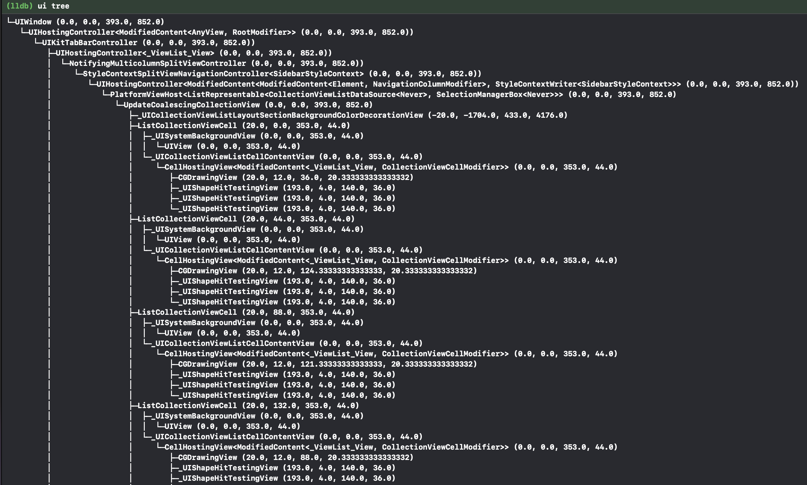
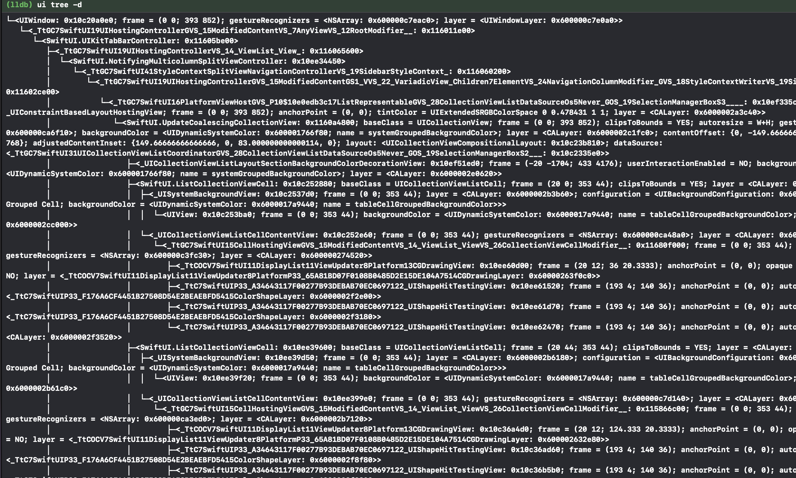
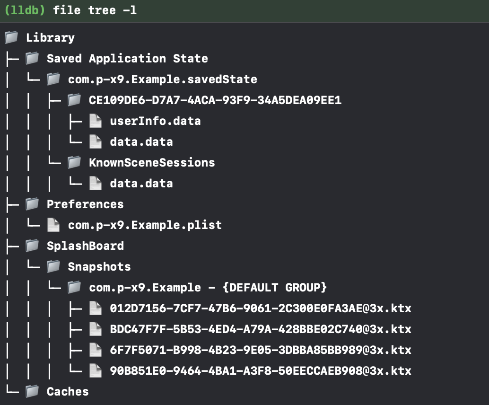

# iLLDB

LLDB Extension for iOS App Development

<!-- # Badges -->

[](https://github.com/p-x9/iLLDB/issues)
[](https://github.com/p-x9/iLLDB/network/members)
[](https://github.com/p-x9/iLLDB/stargazers)
[](https://github.com/p-x9/iLLDB/)

## Feature

- [Show view hierarchy](#ui-hierarchy)
- [Easy operation of UserDefaults](#userdefaults)
- [Show device information](#device-info)
- [Show App information](#app-info)
- [Show file hierarchy](#file-hierarchy)
- [Open directory in Finder (Simulator Only)](#open-directory-in-finder-app-simulator-only)
- [Show file contents](#show-file-contents)
- [Easy operation of HTTP Cookie](#http-cookie)
  - [Show Cookie Values](#read-cookie-value)
  - [Delete Cookie](#delete-cookie)
- [Objective-C Runtime](#objective-c-runtime)
  - [Show inheritance hierarchy of object's class](#show-inheritance-hierarchy-of-objects-class)
  - [Show list of methods of object's class](#show-a-list-of-methods-of-objects-class)
  - [Show list of properties of object's class](#show-a-list-of-proerties-of-objects-class)
  - [Show list of ivars of object's class](#show-a-list-of-ivars-of-objects-class)

## Set up

1. clone this repository
2. Add the following line to ~/.lldbinit

    ```sh
    command script import {PATH TO iLLDB}/src/iLLDB.py
    ```

## Usage

### UI hierarchy
```
(lldb) ui tree -h
usage:  tree
       [-h]
       [-d]
       [-s]
       [--depth DEPTH]
       [--with-address]
       [--window WINDOW]
       [--view VIEW]
       [--vc VC]
       [--layer LAYER]

optional arguments:
  -h, --help
    show this help message and exit
  -d, --detail
    Enable detailed mode (default: False)
  -s, --simple
    Enable simpled mode (default: False)
  --depth DEPTH
    Maximum depth to be displayed (default: None)
  --with-address
    Print address of ui (default: False)
  --window WINDOW
    Specify the target window (default: None)
  --view VIEW
    Specify the target view (property or address) (default: None)
  --vc VC
    Specify the target viewController (property or address) (default: None)
  --layer LAYER
    Specify the target CALayer (property or address) (default: None)
```

#### Example
- Show keyWindow hierarchy
    ```sh
    ui tree
    ```
    

    ```sh
    ui tree -s # simple
    ```
    

    ```sh
    ui tree -d # detail
    ```
    

- Show the hierarchy of a specific view
    ```
    ui tree -view {property name of view}
    ```

- Show the hierarchy of a specific viewController
    ```
    ui tree -vc {property name of viewController}
    ```

- Show the hierarchy of a specific window
    ```
    ui tree -window {property name of window}
    ```

- Show the hierarchy of a specific layer
    ```
    ui tree -layer {property name of layer}
    ```

### UserDefaults
```
usage:
       [-h]
       {read,write,delete,read-all,delete-all}
       ...
UserDefault debugging
optional arguments:
  -h, --help
    show this help message and exit
Subcommands:
  {read,write,delete,read-all,delete-all}
    read
    read UserDefault value
    write
    write UserDefault value
    delete
    delete UserDefault value
    read-all
    read all UserDefault value
    delete-all
    delete all UserDefault value
```
#### read
```sh
ud read "key"
```

#### write
```sh
ud write "key" "value"
```

#### delete
```sh
ud delete "key"
```

#### read all
```sh
ud read-all
```

#### delete all
```sh
ud delete-all
```

### Device Info
Displays device information.
```sh
device info
```


### App Info
Displays App information.
```sh
app info
```


### File hierarchy
```
(lldb) file tree -h
usage:  tree
       [-h]
       [-b]
       [-l]
       [--documents]
       [--tmp]
       [--depth DEPTH]

optional arguments:
  -h, --help
    show this help message and exit
  -b, --bundle
    bundle directory (default: False)
  -l, --library
    library directory (default: False)
  --documents
    documents directory (default: False)
  --tmp
    tmp directory (default: False)
  --depth DEPTH
    Maximum depth to be displayed (default: None)
```

#### Example
- Display the contents of the Bundle directory
    ```sh
    file tree --bundle
    ```

- Display the contents of the Library directory
    ```sh
    file tree --library
    ```

- Display the contents of the Documents directory
    ```sh
    file tree --documents
    ```

- Display the contents of the tmp directory
    ```sh
    file tree --tmp
    ```

- Display the contents of a specific directory
    ```sh
    file tree {url}
    ```


### Open directory in Finder App (Simulator Only)
```
(lldb) file open -h
usage:  open
       [-h]
       [-b]
       [-l]
       [--documents]
       [--tmp TMP]
optional arguments:
  -h, --help
    show this help message and exit
  -b, --bundle
    bundle directory (default: False)
  -l, --library
    library directory (default: False)
  --documents
    documents directory (default: False)
  --tmp TMP
    tmp directory (default: None)
```

### Show file Contents
```
(lldb) file cat -h
usage:  cat
       [-h]
       [--mode MODE]
       path
positional arguments:
  path
    path
optional arguments:
  -h, --help
    show this help message and exit
  --mode MODE
    mode [text, plist] (default: text)
```

#### Example
- text file
  ```
  file cat "path"
  ```
- plist file
  ```
  file cat "path" --mode plist
  ```

### HTTP Cookie
#### Read Cookie Value
Displays the value of the HTTP cookie information.
```
(lldb) cookie read -h
usage:  read
       [-h]
       [--group-id GROUP_ID]
       [--domain DOMAIN]
       [--name NAME]
       [--path PATH]
optional arguments:
  -h, --help
    show this help message and exit
  --group-id GROUP_ID
    AppGroup identifier for cookie storage (default: None)
  --domain DOMAIN
    Domain for Cookie (default: None)
  --name NAME
    Name for Cookie (default: None)
  --path PATH
    Path for Cookie (default: None)
```
##### Example
- Show all cookies
  ```sh
  cookie read
  ```
- Show only cookies for specific domains
  ```sh
  cookie read --domain example.com
  ```
- Show only cookies with a specific name from a specific domain
  ```sh
  cookie read --domain example.com --name KEYNAME
  ```

#### Delete Cookie
Delete cookie value.

After executing the command, you will be asked to confirm before deleting.
If you type "Yes", the deletion will be executed as is.

```
(lldb) cookie delete -h
usage:  delete
       [-h]
       [--group-id GROUP_ID]
       [--domain DOMAIN]
       [--name NAME]
       [--path PATH]
optional arguments:
  -h, --help
    show this help message and exit
  --group-id GROUP_ID
    AppGroup identifier for cookie storage (default: None)
  --domain DOMAIN
    Domain for Cookie (default: None)
  --name NAME
    Name for Cookie (default: None)
  --path PATH
    Path for Cookie (default: None)
```

##### Example
- Delete all cookies
  ```sh
  cookie delete
  ```
- Delete only cookies for specific domains
  ```sh
  cookie delete --domain example.com
  ```
- Delete only cookies with a specific name from a specific domain
  ```sh
  cookie delete --domain example.com --name KEYNAME
  ```

### Objective-C Runtime

Commands for debugging with Objective-C Runtime

#### Show inheritance hierarchy of object's class

```sh
(lldb) objc inherits -h
usage:  inherits
       [-h]
       object
positional arguments:
  object
    object
optional arguments:
  -h, --help
    show this help message and exit
```

##### Example

```sh
(lldb)objc inherits UIWindow()
# NSObject -> UIResponder -> UIView -> UIWindow
```

#### Show a list of methods of object's class

```sh
(lldb) objc methods -h
usage:  methods
       [-h]
       [--class CLASS_NAME]
       [-c]
       [-i]
       object
positional arguments:
  object
    object
optional arguments:
  -h, --help
    show this help message and exit
  --class CLASS_NAME
    Specify a target class in the inheritance hierarchy (default: None)
  -c, --class-only
    Show only class methods (default: False)
  -i, --instance-only
    Show only instance methods (default: False)
```

#### Show a list of proerties of object's class

```sh
(lldb) objc properties -h
usage:  properties
       [-h]
       [--class CLASS_NAME]
       object
positional arguments:
  object
    object
optional arguments:
  -h, --help
    show this help message and exit
  --class CLASS_NAME
    Specify a target class in the inheritance hierarchy (default: None)
```

#### Show a list of ivars of object's class

```sh
(lldb) objc ivars -h
usage:  ivars
       [-h]
       [--class CLASS_NAME]
       object
positional arguments:
  object
    object
optional arguments:
  -h, --help
    show this help message and exit
  --class CLASS_NAME
    Specify a target class in the inheritance hierarchy (default: None)
```

## License

iLLDB is released under the MIT License. See [LICENSE](./LICENSE)
